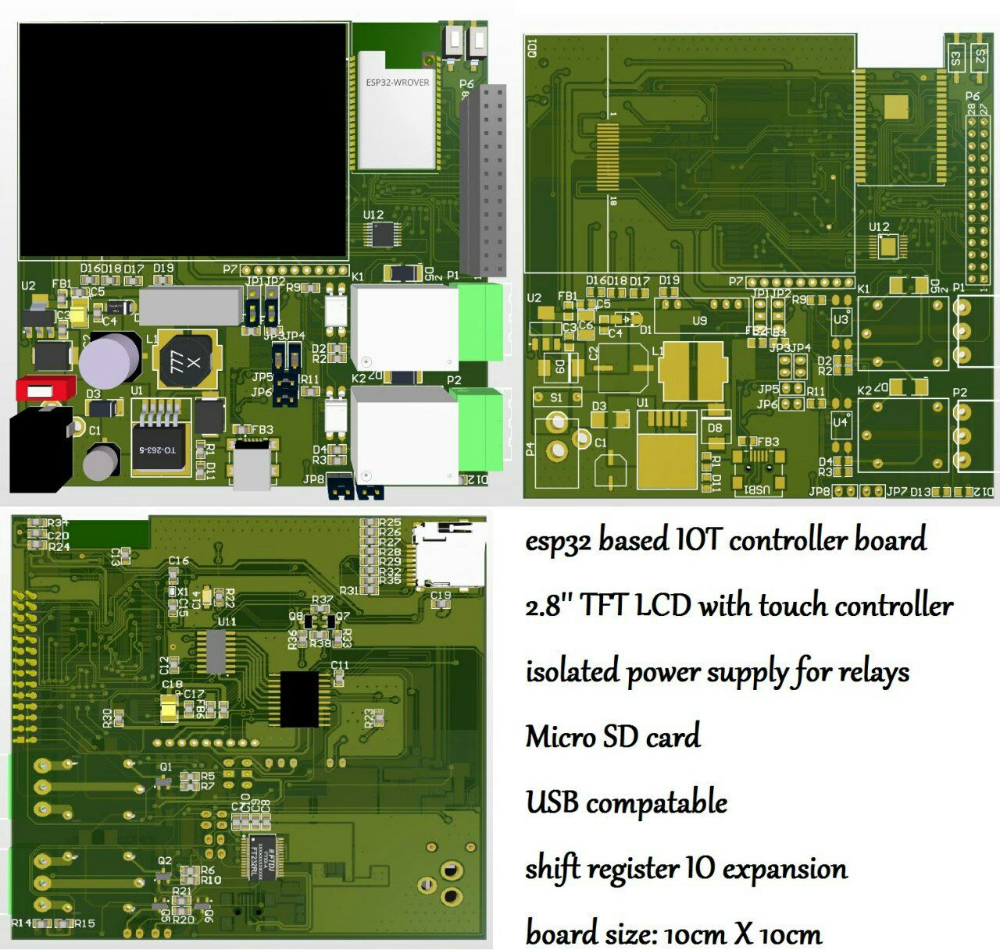

# ESP32_evaluation_pcb_board
 ESP32 based IoT board
 
 board features:
 
 2.8" LCD Display with touch controller
 
 
 Micro SD Card
 
 
 Relays with totaly isolated power supply (using minmax switching converters)
 
 
 USB compatible
 
 
 IO expansion using 74HC595 shift register
 
 
 
 
 
 
